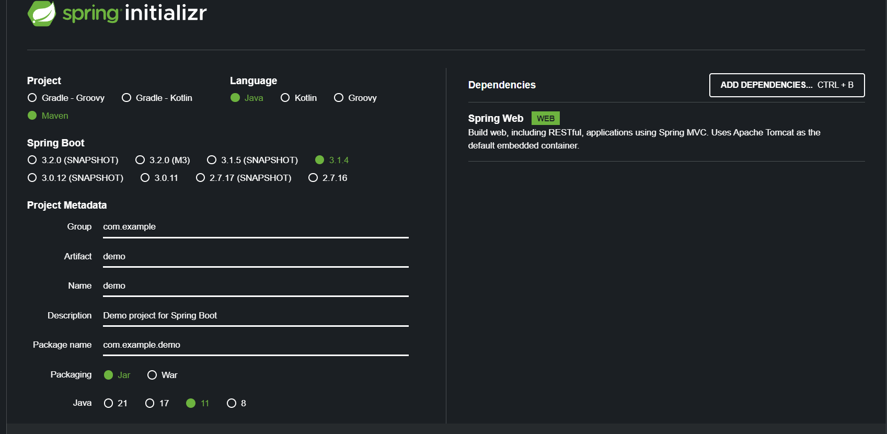

# SpringBoot 3 → Swagger 3



Si es un proyecto de 0 podemos crearlos en [https://start.spring.io](https://start.spring.io/)

Con las siguientes dependencias:

- Spring Web

- Configuración del Swagger

  Agregamos la dependencia de Swagger manual en el POM.XML

    ```xml
    <dependency>
    	<groupId>org.springdoc</groupId>
    	<artifactId>springdoc-openapi-starter-webmvc-ui</artifactId>
    	<version>2.0.2</version>
    </dependency>
    ```

  Ahora agregar una clase de configuración para el swagger con al anotación **@Configure**:

    ```java
    @Configuration
    public class SwaggerConfig {
    
    }
    ```

  Ahora agregamos la configuración en la clase recién creada.

    ```java
    import io.swagger.v3.oas.models.ExternalDocumentation;
    import io.swagger.v3.oas.models.OpenAPI;
    import io.swagger.v3.oas.models.info.Info;
    import io.swagger.v3.oas.models.info.License;
    import org.springframework.context.annotation.Bean;
    import org.springframework.context.annotation.Configuration;
    
    @Configuration
    public class SwaggerConfig {
        @Bean
        public OpenAPI openApiDetails(){
            return new OpenAPI()
                    .info(new Info().title("titulo random")
                            .description("descripcion random")
                            .version("v3.0.1")
                            .license(new License().name("Apache 2.0").url("http://springdoc.org")))
                    .externalDocs(new ExternalDocumentation()
                            .description("")
                            .url("https://github.com"));
        }
    }
    ```

  URL:

  [**http://localhost:8080/swagger-ui/index.html**](http://localhost:8080/swagger-ui/index.html)